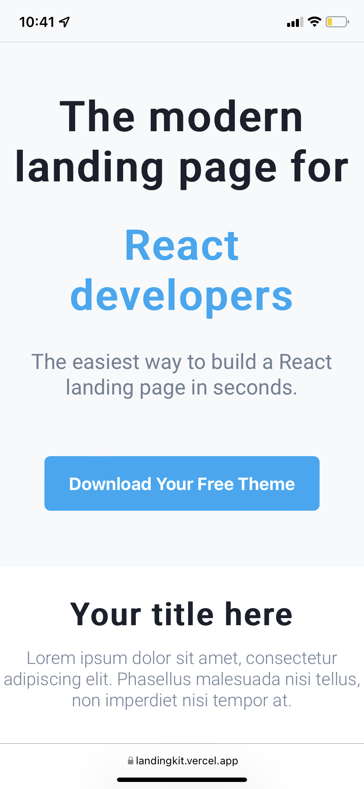

<h1 align="center" style="display: flex; justify-content: center">  Starter Landing Kit</h1>

## 🧪 Technologies

- [Next.js](https://nextjs.org)
- [TypeScript](https://www.typescriptlang.org)
- [EditorConfig](https://editorconfig.org)
- [ESLint](https://eslint.org)
- [Prettier](https://prettier.io)
- [commitlint](https://commitlint.js.org)
- [Husky](https://typicode.github.io/husky)
- [styled-components](https://styled-components.com/)

## 🔥️ Starting the project

```bash
  git clone git@github.com:danicunhac/landingkit.git
  cd landingkit
  yarn
  yarn dev
```

## 📱 Preview

<div>

</div>
